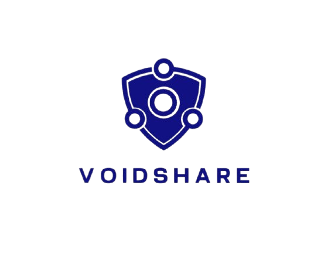

<div align="center">
    
</div>

# VoidShare

VoidShare is a **decentralized peer-to-peer (P2P) encrypted file-sharing system** designed to prioritize privacy and security. It enables users to share files directly with peers without relying on centralized servers, ensuring end-to-end encryption and secure communication.

## Features

- **Decentralized P2P Communication**: Direct file sharing between peers using WebRTC and WebSockets.
- **End-to-End Encryption**: Files are encrypted using AES-256 before transmission, ensuring confidentiality.
- **Secure Key Exchange**: AES keys are securely exchanged using ECC (Elliptic Curve Cryptography).
- **Digital Signatures**: Ensures file integrity and authenticity using RSA-based digital signatures.
- **Real-Time Communication**: Uses WebSockets for signaling and establishing peer connections.
- **Progress Tracking**: Displays real-time progress for file uploads and downloads.
- **Cross-Browser Support**: Works seamlessly in modern browsers with WebRTC and Web Crypto API support.

---

## Table of Contents

1. [Technologies Used](#technologies-used)
2. [How It Works](#how-it-works)
3. [Installation](#installation)
4. [Usage](#usage)
5. [Project Structure](#project-structure)
6. [Screenshots](#screenshots)
7. [Future Enhancements](#future-enhancements)
8. [License](#license)

---

## Technologies Used

- **Frontend**: HTML, CSS, JavaScript
- **Backend**: Node.js with WebSocket server
- **Cryptography**:
  - AES-256 for file encryption
  - ECC for secure key exchange
  - RSA for digital signatures
- **WebRTC**: Peer-to-peer connection establishment
- **WebSockets**: Signaling server for peer discovery and connection setup

---

## Work Flow

1. Users authenticate via a central server (backend with JWT)

2. Peers discover each other using a WebSocket signaling channel

3. Upon connection request and approval, peers establish a secure WebRTC session

4. A session key is generated using ECDHE, then shared via ECC encryption

5. The file is encrypted using AES and transferred in chunks via WebRTC DataChannel

6. The receiver decrypts and reassembles the file

7. The session is terminated and keys are securely discarded
---

## Installation
1. Frontend 
    ```bash
    cd ../frontend
    npm install
    npm run dev
    ```
2. 

### Prerequisites

- Node.js (v14 or higher)
- Modern browser with WebRTC and Web Crypto API support

### Steps

1. **Clone the Repository**:
   ```bash
    https://github.com/Sahil-1918912/VoidShare.git
   cd VoidShare